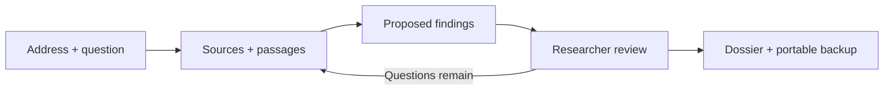

<p align="center">
  
</p>

<p align="center">
  <a href="https://github.com/jestatsio/plot-and-kin/actions/workflows/ci.yml"></a>
  <a href="LICENSE"></a>
  <a href="package.json"></a>
</p>

<p align="center">
  <a href="https://jestatsio.github.io/plot-and-kin/"><strong>Explore the docs</strong></a> ·
  <a href="docs/getting-started.md">Get started</a> ·
  <a href="docs/source-coverage.md">Source coverage</a> ·
  <a href="docs/validation.md">Validation</a>
</p>

# An address is a starting point. Evidence tells the story.

**Plot & Kin helps professional researchers turn property-history questions into reviewable evidence dossiers.** Start with an address and a question. Gather sources, trace people and places, compare conflicting accounts, and carry every conclusion back to its evidence.

An open-source MCP server and Codex workflow plugin, built for **Codex and Claude Desktop**. The service runs on your machine. Research saves locally by default, with an optional guided connection to your own Astra database. Original documents stay in your local library.

<p align="center">
  <a href="https://jestatsio.github.io/plot-and-kin/"></a>
  <br>
  <sub>An actual exported HTML dossier using explicitly fictional demonstration material. It is a report, not a separate web application.</sub>
</p>

## From a lead to a record you can inspect

- **Evidence at the point of the claim.** Link supporting and opposing passages, pages, and image regions. Less precise citations remain visibly less precise.
- **A history that keeps its uncertainty.** Separate proposals from approved conclusions, preserve competing explanations, and retain ambiguous or undated events in the timeline.
- **Review that leaves a trail.** Record decisions against the reviewed version. Corrections preserve prior extractions, and ambiguous identity merges require explicit review.
- **Documents beyond searchable text.** Extract embedded text or choose OpenAI or Anthropic processing for scans, handwriting, photographs, and map excerpts.
- **Research with boundaries.** Checkpoint progress, retain failed searches and next steps, and enforce run limits plus a default $10 project processing budget.
- **Work you can take with you.** Export Markdown, HTML, and JSON. Back up originals, citations, corrections, decisions, and logs, then restore into a fresh project.



## Start with an address. Keep going tomorrow.

**No database account or model key is needed for public records and text documents.** Client packages include Node.js and the document-processing dependencies. Your first local case needs no separate runtime installation or terminal setup.

**Release status:** client packages and one-command installers are being validated. A packaged release and the Git marketplace catalog have not been published yet. Actual desktop-client acceptance remains open.

| Once published | How you will start |
| --- | --- |
| **Claude Desktop extension** | Install the `.mcpb` for your computer from Claude's Extensions settings |
| **Codex custom marketplace** | Add the Plot & Kin marketplace, then install the entry for your computer |
| **Guided setup for either client** | Run one command on macOS or Windows, then choose your client |

See [client packages and marketplace installation](docs/distribution.md) for platform selection, updates, and the separate public-directory submission process. Until publication, the developer path requires **Node.js 22.19+, npm, and Git**:

```sh
git clone https://github.com/jestatsio/plot-and-kin.git
cd plot-and-kin
npm ci
npm run build
node dist/cli.js setup
```

Choose your client and **Save on this computer**. Restart the selected client, then ask:

> Help me research 1920 Rosedale Street NE with Plot & Kin. What do the public building records tell us?

Or ask **“Show me the Plot & Kin sample”** for a labeled fictional case. Review the evidence before approving a finding. Ask for a dossier, then return later with **“Continue my Rosedale Street case.”** The saved research is independent of the original chat.

See [the setup guide](docs/getting-started.md) for the release installer paths, optional Astra connection, scan processing, and recovery. To inspect a standalone synthetic export without connecting a client, run `node dist/cli.js demo`. That CLI demo uses temporary records and never invents a human approval.

## First stop: Washington, DC

The first locality combines **HistoryQuest building records**, **1880 Sanborn map excerpts**, and **researcher-supplied documents, images, and public document URLs**. Subscription material enters through permitted manual imports.

Compiled building information is identified as a research lead. Map excerpts retain attribution and extent. Address matches remain candidates for examination. These sources provide a starting point, with coverage and access limits documented in [source coverage](docs/source-coverage.md).

## Your tools. Your research record.

| Where | What lives there |
| --- | --- |
| **Codex or Claude Desktop** | The research conversation, investigation, and explicit review |
| **Your computer, by default** | A persistent SQLite research database, local MCP tools, originals, derived images, and exports |
| **Your Astra database, if connected** | Structured research for cases you explicitly transfer, or for an explicitly selected Astra default |
| **Your selected model provider, when enabled** | The document or image content required for requested processing |

Astra is optional and does not back up local original documents. No model key is required for public-record and embedded-text workflows. Model-assisted processing uses your chosen provider and credentials, with no silent provider switching. The $10 default processing cap excludes client charges and database hosting. See [setup and recovery](docs/getting-started.md#processing-budget-and-recovery), [evidence and data handling](docs/evidence-and-data.md), and the [privacy notice](docs/privacy.md).

## Built for a careful first pilot

Plot & Kin is a **researcher-facing prototype** under the Apache-2.0 license. Automated tests, real stdio checks, and live Astra/DC connector checks are recorded in [validation](docs/validation.md). Actual desktop-client acceptance, live model extraction quality, and researcher effectiveness still need evaluation.

Review approvals are recorded workflow decisions, not an independently authenticated human-only control. Nationwide coverage, GIS alignment, shared accounts, hosted billing, and a standalone web application are outside this prototype.

| Explore | Purpose |
| --- | --- |
| [Getting started](docs/getting-started.md) | Installation, both clients, processing, recovery, and backups |
| [Client packages and marketplaces](docs/distribution.md) | Claude Desktop extensions, Codex catalogs, updates, and publication status |
| [Evidence and data](docs/evidence-and-data.md) | Citation precision, review rules, provenance, and data boundaries |
| [Source coverage](docs/source-coverage.md) | DC connectors, fixture provenance, attribution, and gaps |
| [Client acceptance](docs/client-acceptance.md) | The same research journey in Codex and Claude Desktop |
| [Validation](docs/validation.md) | What has been checked and what remains unverified |
| [Researcher pilot](docs/pilot.md) | Recruitment materials and the evaluation protocol |

Contributions to source coverage, evidence handling, and reproducible case evaluation are welcome. Start with the [development checks](docs/getting-started.md#development-and-validation).

[Apache License 2.0](LICENSE) · [Privacy](docs/privacy.md) · Original materials retain their own rights and attribution requirements.
