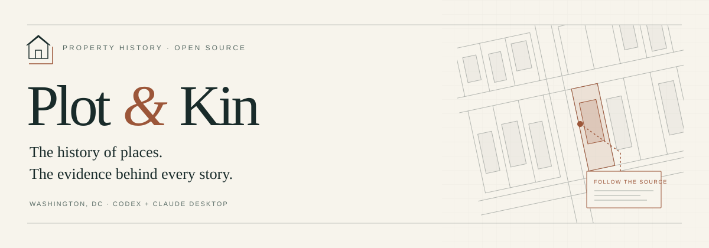
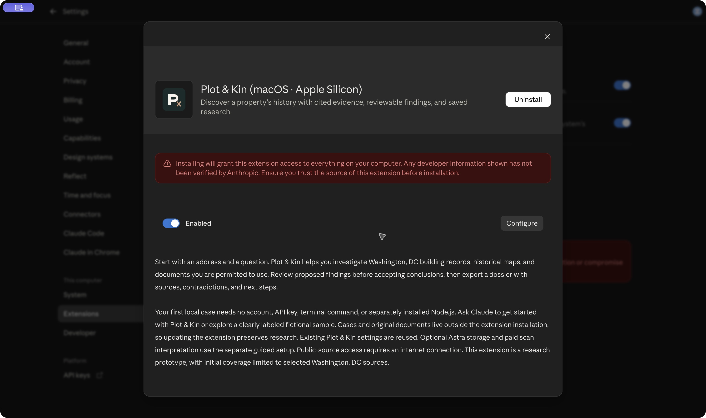
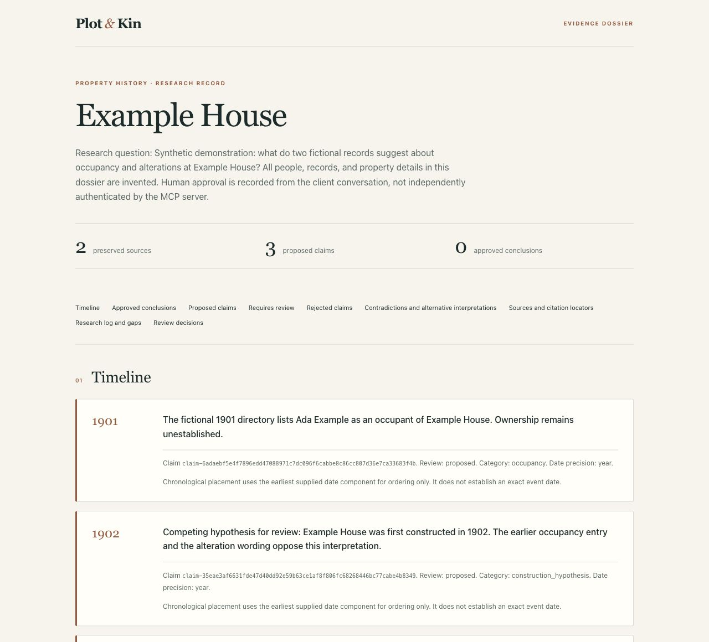
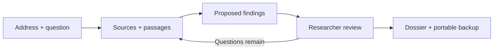

<p align="center">
  
</p>

<p align="center">
  <a href="https://github.com/jestatsio/plot-and-kin/actions/workflows/ci.yml"></a>
  <a href="LICENSE"></a>
  <a href="docs/distribution.md"></a>
</p>

<p align="center">
  <a href="docs/distribution.md#release-downloads"><strong>Install Plot & Kin</strong></a> ·
  <a href="https://jestatsio.github.io/plot-and-kin/">Explore the docs</a> ·
  <a href="docs/source-coverage.md">Source coverage</a> ·
  <a href="docs/validation.md">Validation</a>
</p>

# An address is a starting point. Evidence tells the story.

**Turn a property-history question into a dossier you can stand behind.** Plot & Kin helps professional researchers gather sources, trace people and places, compare conflicting accounts, and carry every conclusion back to its evidence.

Work in **Codex, Claude Code, or Claude Desktop**. Plot & Kin runs on your computer and saves the research between conversations. Start with local storage, add your own Astra database when you need it, and keep original documents in your local library. Open source under Apache-2.0.

## Choose your client. Start your first case.

**Native Codex and Claude Desktop packages need no separate Node.js installation, Astra account, or model API key for public records and text documents.** They include the runtime and document tools. Claude Code requires Node.js and npm. Your client's account and charges are separate.

| How you work | Install path | What you do |
| --- | --- | --- |
| **Claude Desktop** | [Desktop extension](docs/distribution.md#claude-desktop) · `.mcpb` | Download your platform's package, then select it in **Settings → Extensions → Advanced settings → Install extension** |
| **Claude Code** | [Git plugin](docs/distribution.md#claude-code) | Add the `claude-plugins` branch and install Plot & Kin. Requires Node.js 22.19+, npm, and Claude Code 2.1.291+ |
| **Codex** | [Local marketplace](docs/distribution.md#codex-offline-marketplace) · `-codex.zip` | Extract the package, add its folder as a marketplace source, then install **Plot & Kin** |
| **Codex and Claude Desktop** | [Guided setup](docs/distribution.md#guided-setup-from-a-preview) | Choose your client and **Save on this computer**. The release installer downloads and verifies the runtime before setup |

**[Download v0.1.0 →](docs/distribution.md#release-downloads)** Choose **Apple Silicon Mac** (`darwin-arm64`), **Intel Mac** (`darwin-x64`), or **Windows x64** (`win32-x64`). Public GitHub release downloads include packages and SHA-256 checksums.

> **Release status · October 7, 2026:** v0.1.0 and the Codex and Claude Code Git catalogs are published. Native package checks pass on all three platforms. Official directory review and publication remain separate gates. Plot & Kin remains a researcher-facing prototype.

Once installed, open a new chat:

> Help me get started with Plot & Kin.

Try **“Show me the Plot & Kin sample”** for a clearly labeled fictional case, or begin with your own question:

> Research 1920 Rosedale Street NE in Washington, DC. What do the available building records tell us about its early construction?

Review the cited evidence, approve only the findings you accept, and ask **“Show the dossier here and save an HTML copy.”** Come back later with **“Continue my Rosedale Street case.”** Cases, originals, and research history live outside the plugin installation.

<details>
<summary><strong>See Plot & Kin installed in Claude Desktop</strong></summary>

<p align="center">
  
  <br>
  <sub>Actual direct installation on macOS Apple Silicon. Claude displays its standard local-extension warning. This is not a directory endorsement. <a href="docs/acceptance/2026-10-01-claude-desktop.md">Read the walkthrough evidence.</a></sub>
</p>

</details>

## A research record you can inspect

<p align="center">
  <a href="https://jestatsio.github.io/plot-and-kin/"></a>
  <br>
  <sub>An actual exported HTML dossier using explicitly fictional demonstration material. It is a report, not a separate web application.</sub>
</p>

- **Evidence at the point of the claim.** Link supporting and opposing passages, pages, and image regions. Less precise citations remain visibly less precise.
- **A history that keeps its uncertainty.** Separate proposals from approved conclusions, preserve competing explanations, and retain ambiguous or undated events in the timeline.
- **Review that leaves a trail.** Record decisions against the reviewed version. Corrections preserve prior extractions, and ambiguous identity merges require explicit review.
- **Documents beyond searchable text.** Extract embedded text or choose OpenAI or Anthropic processing for scans, handwriting, photographs, and map excerpts.
- **Research with boundaries.** Save progress, failed searches, and next steps within bounded runs. Optional model processing has a default $10 cumulative project budget.
- **Work you can take with you.** Export Markdown, HTML, and JSON. Back up originals, citations, corrections, decisions, and logs, then restore into a fresh project.



## First stop: Washington, DC

The first locality combines **HistoryQuest building records**, **1880 Sanborn map excerpts**, and **researcher-supplied documents, images, and public document URLs**. Subscription material enters through permitted manual imports.

Compiled building information is a research lead. A permit date does not establish a construction date, and ownership does not establish occupancy. Map excerpts retain attribution and extent. Address matches remain candidates for examination. See [source coverage](docs/source-coverage.md) for the starting sources, their provenance, and their limits.

## Your tools. Your research record.

| Where | What lives there |
| --- | --- |
| **Codex or Claude Desktop** | The research conversation, investigation, and explicit review |
| **Your computer, by default** | A persistent SQLite research database, local MCP tools, originals, derived images, and exports |
| **Your Astra database, if connected** | Structured research for cases you explicitly transfer, or for an explicitly selected Astra default |
| **Your selected model provider, when enabled** | The document or image content required for requested processing |

Astra is optional and does not back up local original documents. Model-assisted processing uses your chosen provider and credentials, with no silent provider switching. The $10 default processing cap excludes client charges and database hosting. Default runs allow **30 minutes, 25 external search requests, and 50 processed pages**. Saved progress survives a stopped run.

See [optional setup](docs/distribution.md#optional-astra-and-scan-processing), [evidence and data handling](docs/evidence-and-data.md), and the [privacy notice](docs/privacy.md).

## Built for a careful first pilot

Plot & Kin is a **researcher-facing prototype**. Native package checks and actual Codex loader/restart tests pass on all three supported platforms. A Claude Desktop walkthrough on Apple Silicon verified installation, a fictional sample, citation reading, and dossier export. The full desktop journeys, live model extraction quality, and researcher effectiveness remain under evaluation. See [client acceptance](docs/client-acceptance.md) and [validation](docs/validation.md) for the evidence and remaining checks.

Review approvals are recorded workflow decisions, not an independently authenticated human-only control. Nationwide coverage, GIS alignment, shared accounts, hosted billing, and a standalone web application are outside this prototype.

## Build from source

For contributors and researchers who prefer a checkout, install **Node.js 22.19+, npm, and Git**, then run:

```sh
git clone https://github.com/jestatsio/plot-and-kin.git
cd plot-and-kin
npm ci
npm run build
node dist/cli.js setup
```

Choose your client and **Save on this computer**, then restart the client. Keep the checkout and Node executable in place for this installation. Run `node dist/cli.js demo` to generate a synthetic dossier without connecting a client. That CLI demo uses temporary records and never invents a researcher approval.

See [development checks](docs/getting-started.md#development-and-validation) before contributing. Improvements to source coverage, evidence handling, and reproducible case evaluation are welcome.

## Keep exploring

| Explore | Purpose |
| --- | --- |
| [Getting started](docs/getting-started.md) | Installation, both clients, processing, recovery, and backups |
| [Client packages and marketplaces](docs/distribution.md) | Claude Desktop extensions, Codex catalogs, updates, and publication status |
| [Evidence and data](docs/evidence-and-data.md) | Citation precision, review rules, provenance, and data boundaries |
| [Source coverage](docs/source-coverage.md) | DC connectors, fixture provenance, attribution, and gaps |
| [Client acceptance](docs/client-acceptance.md) | The same research journey in Codex and Claude Desktop |
| [Validation](docs/validation.md) | What has been checked and what remains unverified |
| [Researcher pilot](docs/pilot.md) | Recruitment materials and the evaluation protocol |

[Apache License 2.0](LICENSE) · [Privacy](docs/privacy.md) · Original materials retain their own rights and attribution requirements.
